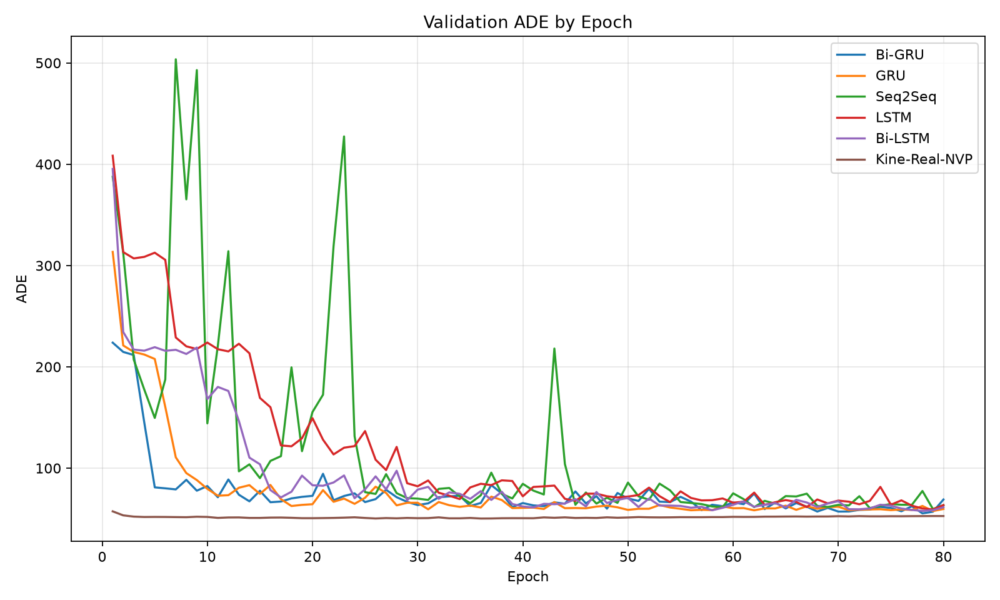
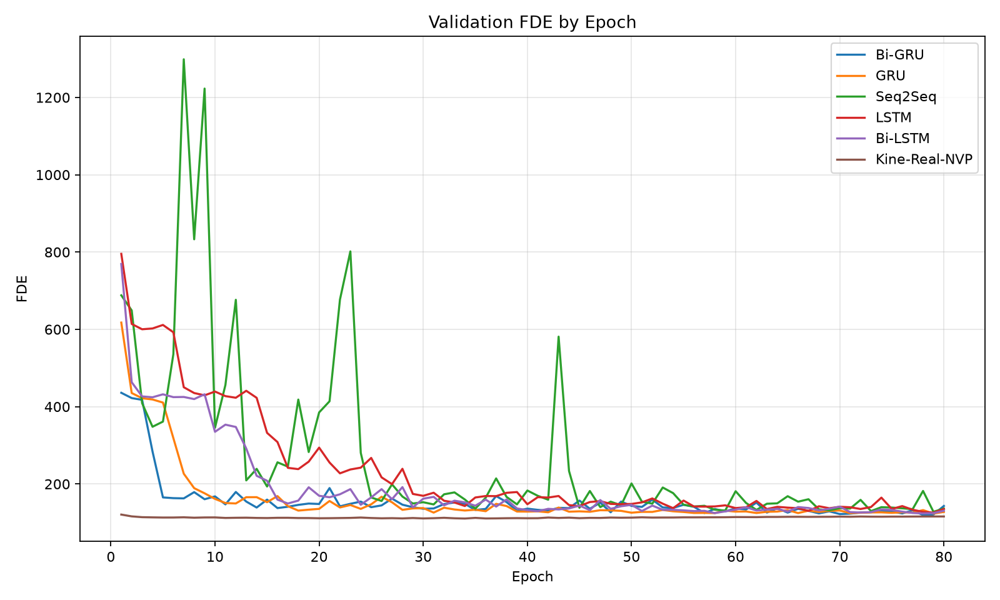

# KineRoute-NVP

KineRoute-NVP is a focused research implementation for deterministic short-term vessel trajectory forecasting on EnvShip-Bench. The repository uses one experiment interface and artifact contract across recurrent, MLP, TCN, Transformer, standard RealNVP, routed invertible, and routed unconstrained controls.

The model learns a supervised invertible map from 30 observed vessel positions to 30 future positions using a routed RealNVP architecture over a heading-aligned displacement chart. Evaluation is reported with Average Displacement Error (ADE) and Final Displacement Error (FDE) in meters.

## Dataset

Experiments use the official compact paper subsets from:

`mark000071/EnvShip-Bench_An_Environment-Enhanced_Benchmark_for_Short-Term_Vessel_Trajectory_Prediction`

Local aliases:

- `data/envship/paper_dma_clean_ship_core_lite_v1`
- `data/envship/paper_noaa_clean_ship_core_lite_v1`

Combined split sizes:

- train: `29635`
- val: `3667`
- test: `3262`

Download and verify:

```bash
python scripts/download_envship.py --datasets dma_clean noaa_clean
python scripts/verify_download.py --dataset dma_clean
python scripts/verify_download.py --dataset noaa_clean
```

## Experiments

Every run is defined by one YAML under `experiments/`. One YAML corresponds to one run.

```bash
python scripts/train.py --config experiments/baselines/kine_real_nvp_paper.yaml
```

Batch execution stays reproducible through checked-in launchers:

```bash
bash experiments/baselines/run_all.sh
```

Each invocation creates exactly one directory:

`results/<timestamp>__<experiment_name>__<run_name>/`

That directory contains:

- `resolved_config.yaml`
- `command.txt`
- `logs/metrics.jsonl`
- `checkpoints/`
- `evaluation/`
- `figures/`
- `_results.json`

Both training entry points use the same experiment-artifact contract. A
full-state checkpoint is saved every 10 epochs (the runner does not yet expose
automatic resume), and each run always contains
`figures/val_ade_vs_epoch.png` and `figures/val_fde_vs_epoch.png` alongside its
machine-readable results. See
[Experiment Artifact Contract](docs/experiment-artifacts.md) for the lifecycle,
checkpoint contents, run layout, and extension rules for new methods and
ablations.

Compact experiments use [one frozen split shared by all five training seeds](docs/compact-split-protocol.md).

## Historical Baseline Artifact

The following pre-audit artifact remains available for inspection:

- best epoch: `36`
- best val ADE/FDE: `50.2624 / 110.8145`
- test ADE/FDE: `50.3953 / 112.0903`

Artifacts:

- run directory: `results/20260705_163634__baselines__kine_real_nvp_paper`
- comparison plots: `plots/`
- experimental setup draft tex: [latex/experimental-setup-draft.tex](latex/experimental-setup-draft.tex)
- experimental setup draft pdf: [latex/experimental-setup-draft.pdf](latex/experimental-setup-draft.pdf)

Validation ADE by epoch:



Validation FDE by epoch:



It is **not** an official result for the current controlled study: it predates
artifact schema 2, exact dirty-worktree source fingerprints, strict processed
array fingerprints, and the finalized normalization/test-selection protocol.
Do not mix it with new ablation tables or cite it as the current benchmark.
Official results are accepted only through the strict experiment-specific
aggregators described in `todo.md`.

## Repository Layout

- `src/kineroute_nvp/`: model, preprocessing, training, evaluation
- `scripts/`: download, verification, training, plotting
- `experiments/`: YAML-defined runs and launchers
- `latex/`: paper-facing writeups

## Note on Invertibility

The learned mapping is numerically invertible in chart space, but the dataset task is not semantically bijective from vessel future back to true vessel past. Forward forecasting can therefore be strong while reverse-history reconstruction remains physically uninformative.
